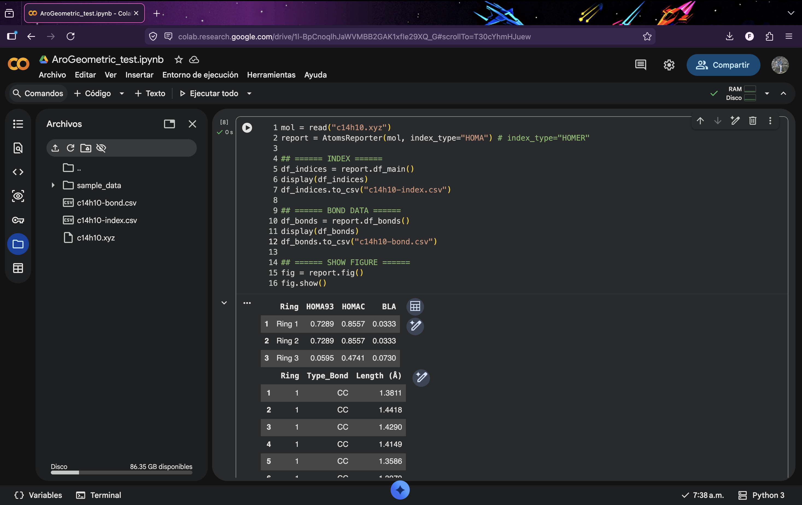
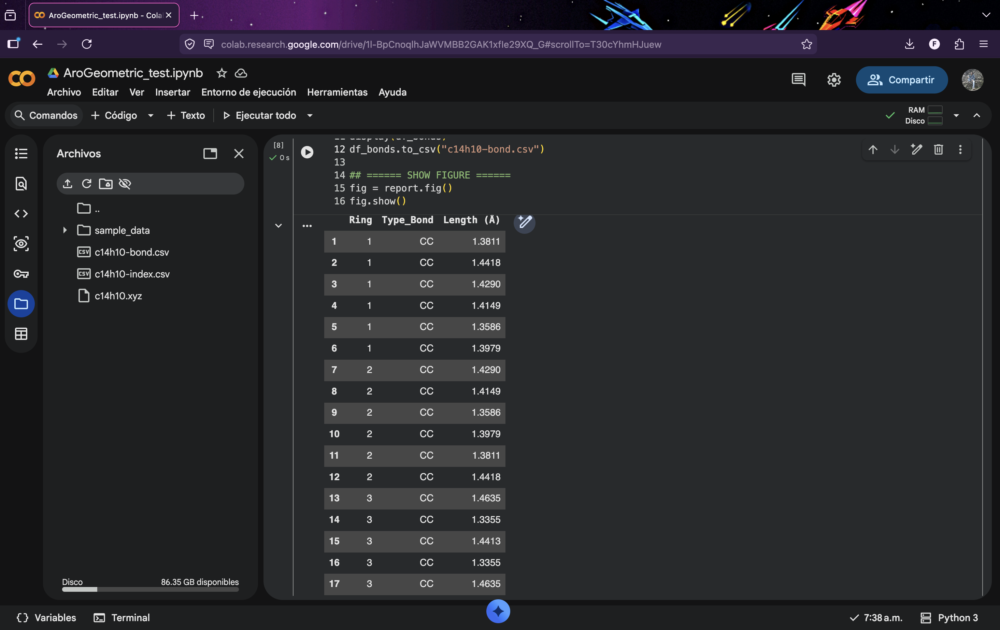
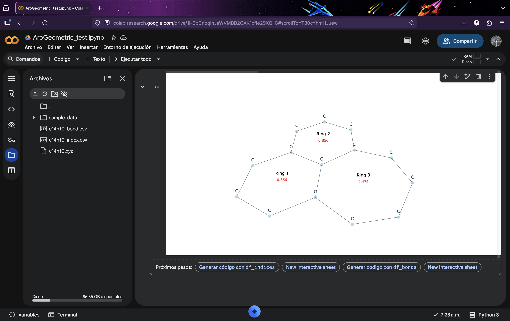

# AroGeometric

AroGeometric is the AromaTools module for evaluating aromaticity using **geometric descriptors** derived from molecular structure.

The module provides an automated workflow for detecting molecular rings, evaluating bond-length equalization, and computing aromaticity indices commonly used in computational chemistry.

---

## Overview

AroGeometric automatically:

- Detects molecular rings
- Constructs the molecular graph
- Computes bond distances
- Evaluates geometric aromaticity indices
- Generates tables with bond-length information
- Produces graphical representations of cyclic systems

Only molecular geometry is required as input.

Supported sources include:

- Gaussian output files
- ORCA output files
- XYZ files
- CML files
- other formats supported by ASE

---

## Implemented indices

The following geometric descriptors are implemented:

- HOMA93
- HOMAc
- HOMER
- BLA (Bond Length Alternation)

These indices quantify aromaticity through the degree of bond-length equalization in cyclic systems.

---

## Quick start

We recommend using this module in Google Colab:

<https://colab.research.google.com/>

### Install ASE

```python
!pip3 install ase
```

### Import necessary libraries

```python
from ase.io import read
from aromatools.arogeometric import AtomsReporter
```

### Calculate the indices

```python
mol = read("mol.xyz")  # Your molecule in XYZ format or output file from Gaussian or ORCA
report = AtomsReporter(mol, index_type="HOMER")  # Use "HOMA" or "HOMER"

# ====== INDICES ======
df_indices = report.df_main()
display(df_indices)
df_indices.to_csv("mol-indices.csv", index=False)

# ====== BOND DATA ======
df_bonds = report.df_bonds()
display(df_bonds)
df_bonds.to_csv("mol-bonds.csv", index=False)

# ====== SHOW FIGURE ======
fig = report.fig()
fig.show()
```

---

## Workflow

The module follows these steps:

1. Read molecular geometry.
2. Build the molecular graph.
3. Detect rings.
4. Compute bond distances.
5. Evaluate aromaticity indices.
6. Generate visualization.

Graph construction is based on covalent radii.

---

## Theoretical background

### HOMA index

The harmonic oscillator model of aromaticity is defined as:

$$
HOMA = 1 - \frac{1}{n}\sum_{i=1}^{n} \alpha (R_i - R_{opt})^2
$$

where:

- $n$ is the number of bonds
- $R_i$ is the bond length
- $R_{opt}$ is the optimal aromatic bond length
- $\alpha$ is a normalization constant

HOMA values close to 1 indicate aromatic character, values near 0 correspond to non-aromatic systems, and negative values indicate antiaromaticity.

---

### Parameter sets

**HOMA93 parameters**

| Bond | Ropt (Å) | α (Å⁻²) |
|------|----------|---------|
| CC   | 1.388    | 257.70  |
| CN   | 1.334    | 93.52   |
| NN   | 1.309    | 130.33  |
| CO   | 1.265    | 157.38  |

Reference: [HOMA article](https://www.sciencedirect.com/science/article/pii/S0040403901941759)

**HOMAc parameters (ground state S₀)**

| Bond | Ropt (Å) | α (Å⁻²) |
|------|----------|---------|
| CC   | 1.392    | 153.37  |
| CN   | 1.333    | 111.83  |
| NN   | 1.318    | 98.99   |
| CO   | 1.315    | 335.16  |

Reference: [HOMAc article](https://pubs.acs.org/doi/full/10.1021/acs.joc.4c02475)

**HOMER parameters (excited state T₁)**

| Bond | Ropt (Å) | α (Å⁻²) |
|------|----------|---------|
| CC   | 1.437    | 950.74  |
| CN   | 1.390    | 506.43  |
| NN   | 1.375    | 187.36  |
| CO   | 1.379    | 164.96  |

Reference: [HOMER article](https://pubs.rsc.org/en/content/articlehtml/2023/cp/d3cp00842h)

---

## Output

After executing the calculation, AroGeometric generates tabulated data and graphical representations that summarize the structural aromaticity analysis.

### Generated data

Two main tables are produced.

#### Aromaticity indices

A table containing the evaluated geometric indices for each detected ring:

```text
mol-indices.csv
```

This file typically includes:

- Ring identifier
- Index type  
    - If `index_type="HOMA"`, the program reports HOMA93, HOMAc and BLA
    - If `index_type="HOMER"`, the program reports HOMER and BLA



#### Bond values

A table showing bond distances:

```text
mol-bonds.csv
```

This file typically includes:

- Ring identifier
- Bond type
- Length (Å)



### Graphical output

AroGeometric generates a graphical representation of the molecule highlighting cyclic structures:

```python
fig = report.fig()
fig.show()
```



The figure shows:

- Molecular connectivity
- Detected rings
- Topology of the cyclic system
- Structural framework used for index evaluation

This visualization helps verify ring detection and provides an intuitive representation of the molecular structure.
